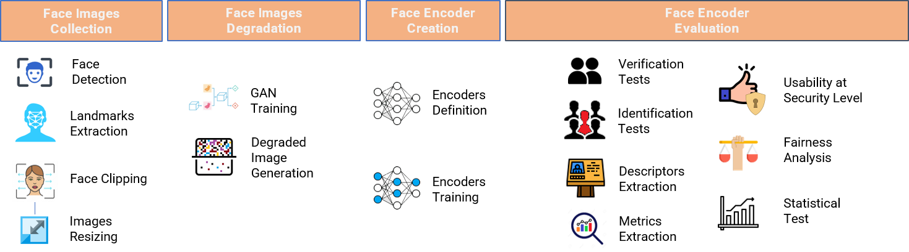
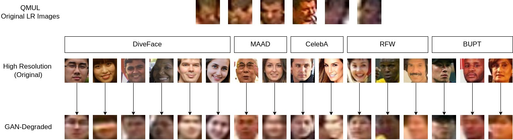

# Demographic Bias in Deep Face Recognition in The Wild

This is the official repository of the paper entitled "Demographic Bias in Deep Face Recognition in The Wild".
 

  

 

We provide a Pytorch toolbox for Face Images Degradation (1) and Face Recognition training and testing (2). 

1) The Image Degradation module provides 
 

  

 
2) The Face Recognition module provides a training part with various SOTA Face Recognition backbones and heads and
an evaluation part that:
- Provides evaluations of the given model(s) in order to obtain metrics like ROC curves, AUCs, EERs, EERs@FAR1% etc.
 

  

 

- Provides metrics as FAR and FRR variation across multiple factors like sex and ethnicity and their combinations
 

  

 