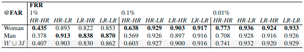
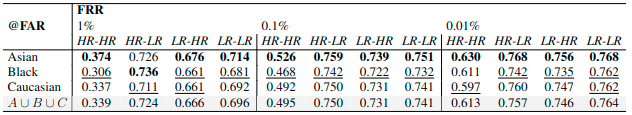
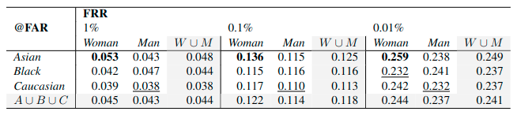

# Demographic Bias in Deep Face Recognition in The Wild

This is the official repository of the paper entitled "Demographic Bias in Deep Face Recognition in The Wild", which is currently under review on JSTSP (Journal of Selected Topics on Signal Processing).
 

  

 

We provide a Pytorch toolbox for Face Images Degradation (1) and Face Recognition training and testing (2). 

1) The Image Degradation module provides a training part for both GANs and their Discriminators and a use/evaluation part that:
- Degrades given datasets
 

  

 

- Shows the results of the degradation in relation to other types of algorithmic disturbances and to original images acquired in unconstrained environments

 

  

 

2) The Face Recognition module provides a training part with various SOTA Face Recognition backbones and heads and
an evaluation part that:
- Provides evaluations of the given model(s) in order to obtain metrics like ROC curves, AUCs and EERs.
 

  

 

- Provides metrics as FRR@FARs (FNIR@FPIRs) variation across multiple factors like sex and ethnicity and their combinations
 

  

 
 

  

 
 

  

 

## Requirements
- Python >= 3.7
- PyTorch >= 1.10.0
- DeepFace == 0.0.72
- MatPlotLib == 3.5.2
- Scikit Learn == 1.0.1
- Scipy == 1.7.1
- Seaborn == 0.11.2

In order to install all the necessary prerequisites, you can simply execute the following command: \
`pip install -r requirements.txt`

## Degradation Module

### GAN Training
See <a href="src/1_image_degradation/training_module/README.md" target="_blank">README</a> in <a href="src/1_image_degradation/training_module" target="_blank">src/image_degradation_rq1/training_module</a> folder

### GAN Evaluation

See <a href="src/1_image_degradation/evaluation_module/README.md" target="_blank">README</a> in <a href="src/1_image_degradation/evaluation_module" target="_blank">src/1_image_degradation/evaluation_module</a> folder

### Image Degradation

See <a href="src/1_image_degradation/degradation_module/README.md" target="_blank">README</a> in <a href="src/1_image_degradation/degradation_module" target="_blank">src/1_image_degradation/degradation_module</a> folder

## Face Recognition Module
### Model Training
See <a href="src/2_face_recognition/training/README.md" target="_blank">README</a> in <a href="src/2_face_recognition/training" target="_blank">src/2_face_recognition/training</a>

### Dataset Preprocessing and combined models training
See <a href="src/2_face_recognition/README.md" target="_blank">README</a> in <a href="src" target="_blank">src/2_face_recognition</a> folder

### Model Evaluation
See <a href="src/2_face_recognition/experimental/README.md" target="_blank">README</a> in <a href="src/2_face_recognition/experimental" target="_blank">src/2_face_recognition/experimental</a> folder

## Contributing
This code is provided for educational purposes and aims to facilitate reproduction of our results, and further research in this direction. We have done our best to document, refactor, and test the code before publication.

If you find any bugs or would like to contribute new models, training protocols, etc, please let us know.

Please feel free to file issues and pull requests on the repo and we will address them as we can.

## License

This code is free software: you can redistribute it and/or modify it under the terms of the GNU General Public License as published by the Free Software Foundation, either version 3 of the License, or (at your option) any later version.

This software is distributed in the hope that it will be useful, but without any warranty; without even the implied warranty of merchantability or fitness for a particular purpose. See the GNU General Public License for details.

You should have received a copy of the GNU General Public License along with this source code. If not, go the following link: http://www.gnu.org/licenses/.

## Acknowledgements

This work is an extension of <a href="https://github.com/atzoriandrea/Exploratory-Analysis-in-Face-Authentication" target="_blank">Explaining Disparate Impacts in Face Recognition via Image Characteristics</a>, that will be published in International Joint Conference on Biometrics (IJCB 2022) proceedings. 

`
@misc{https://doi.org/10.48550/arxiv.2208.11099,
  doi = {10.48550/ARXIV.2208.11099},
  url = {https://arxiv.org/abs/2208.11099},
  author = {Atzori, Andrea and Fenu, Gianni and Marras, Mirko},
  keywords = {Computer Vision and Pattern Recognition (cs.CV), FOS: Computer and information sciences, FOS: Computer and information sciences},
  title = {Explaining Bias in Deep Face Recognition via Image Characteristics},
  publisher = {arXiv},
  year = {2022},
  copyright = {arXiv.org perpetual, non-exclusive license}
}
`

