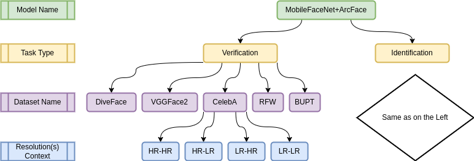
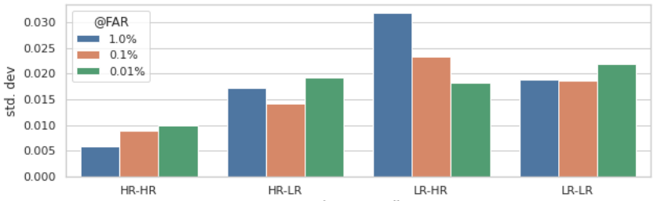
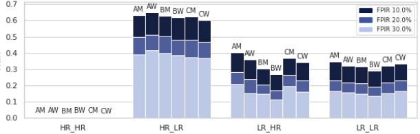
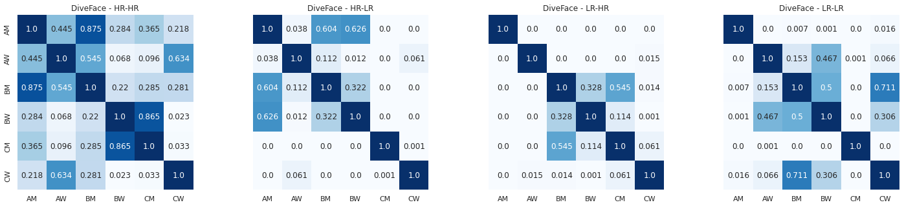
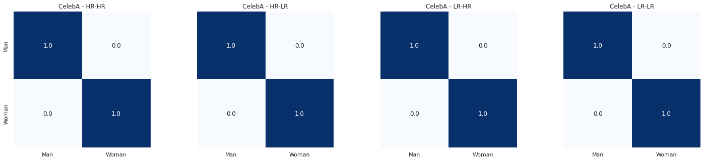
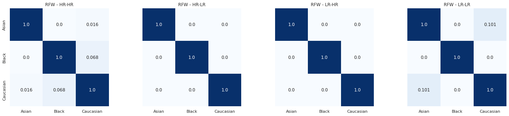

# Scripts description

Examples of dataset files list(s), verification pair(s) and annotated json file(s) can be found in this 
<a href="https://drive.google.com/drive/folders/1deLxJRsiFZpsIAv2nfUwNRWC8nD87wV6?usp=sharing" target="_blank">Google Drive</a> folder

## 1. dataset_embedding.py parameters description
- `--models` : path to the folder containing models with which you want to extract datasets embeddings
- `--images_list` :  txt file containing a list of files (one per dataset-resolution) in which all images  are listed

## 2. verification_cosines.py parameters description
 - `--model` : path to a single model that you want to evaluate
 - `--models` : path to a .txt file containing full paths to all models you want to evaluate
 - `--cmps` : path of the .csv file in which all couples are listed
 - `--base` : path to dataset basepath

## 3. identification_cosines.py 
 - This script does not need any kind of parameter. Simply add/modify/remove paths from identifications_files_dict.py and launch the script

 

  

 

## 4. fairness_plots_across_resolutions.py
 - `--results_root` : root directory containing all .npy files with cosines and other info (you can compute them using script 2. or 3.). Your folder structure MUST be the same as the image above

 

  

 
 

  

 

## 5. fairness_correlations.py
 - `--results_root` : root directory containing all .npy files with cosines and other info (you can compute them using script 2. or 3.). Your folder structure MUST be the same as the image above

 

  

 

 

  

 

 

  

 
